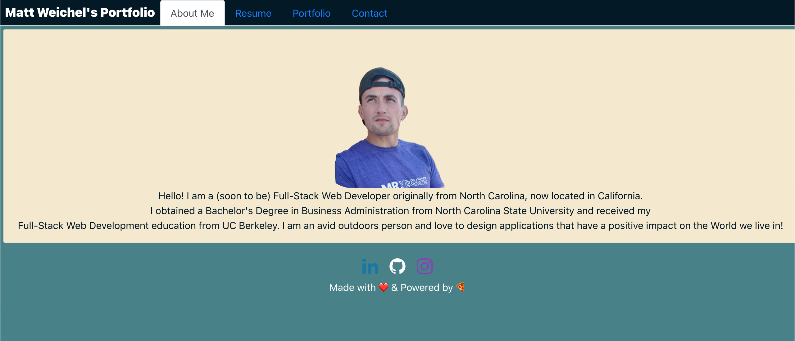
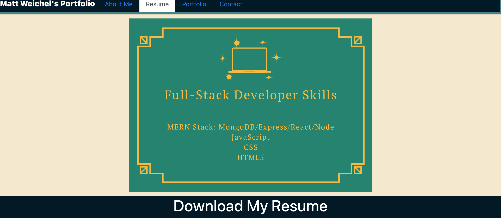
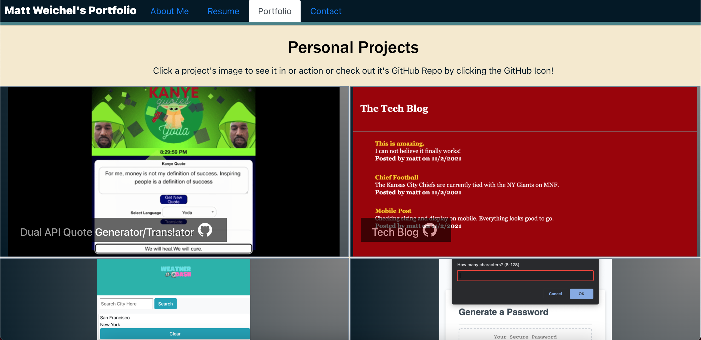
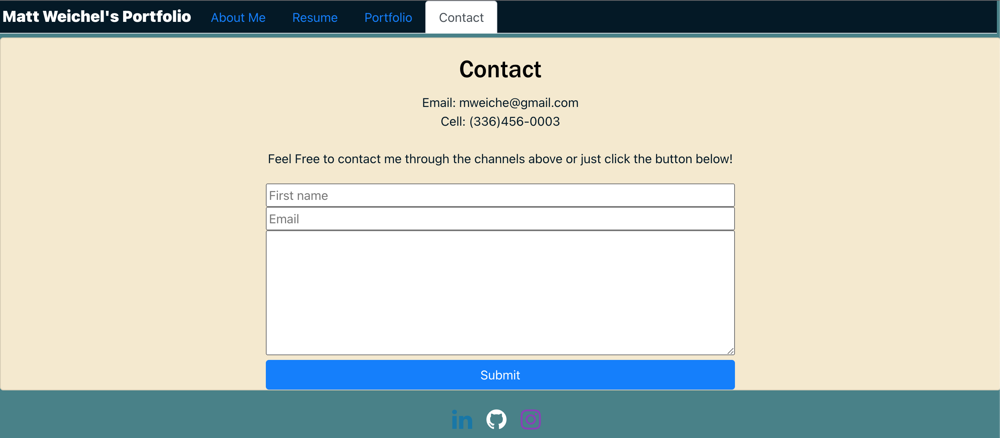

# React Portfolio

The goal of this portfolio is to provide an updated snapshot of my current professional work and contact utilizing React. Users have the ability to reach my social media channels with the click of an icon, download my resume, send me an email.  The site is primarily constructed of Bootstrap/Custom CSS and is Mobile Responsive, adapting to any screen size by stacking into columns and shrinking.

## Built With

* [HTML](https://developer.mozilla.org/en-US/docs/Web/HTML)
* [CSS](https://developer.mozilla.org/en-US/docs/Web/CSS)
* [Javascript](https://developer.mozilla.org/en-US/docs/Web/JavaScript)
* [Bootstrap](https://developer.mozilla.org/en-US/docs/Web/JavaScript)
* [Moment.JS](https://developer.mozilla.org/en-US/docs/Web/JavaScript) 
* [React.JS](https://reactjs.org/)

## Deployed Link

* [See Live Site](https://github.com/maweiche/reactPortfolio)

## Live Site Snapshots

## Authors

* **Matt Weichel** 

- [Link to Portfolio Site](https://github.com/maweiche/reactPortfolio)
- [Link to Github](https://github.com/maweiche)
- [Link to LinkedIn](https://www.linkedin.com/in/mattweichel/)

## License

This project is licensed under the MIT License 

## Acknowledgments

* Hat tip to anyone whose code, libraries, packages, or UI was used  / inspired from
